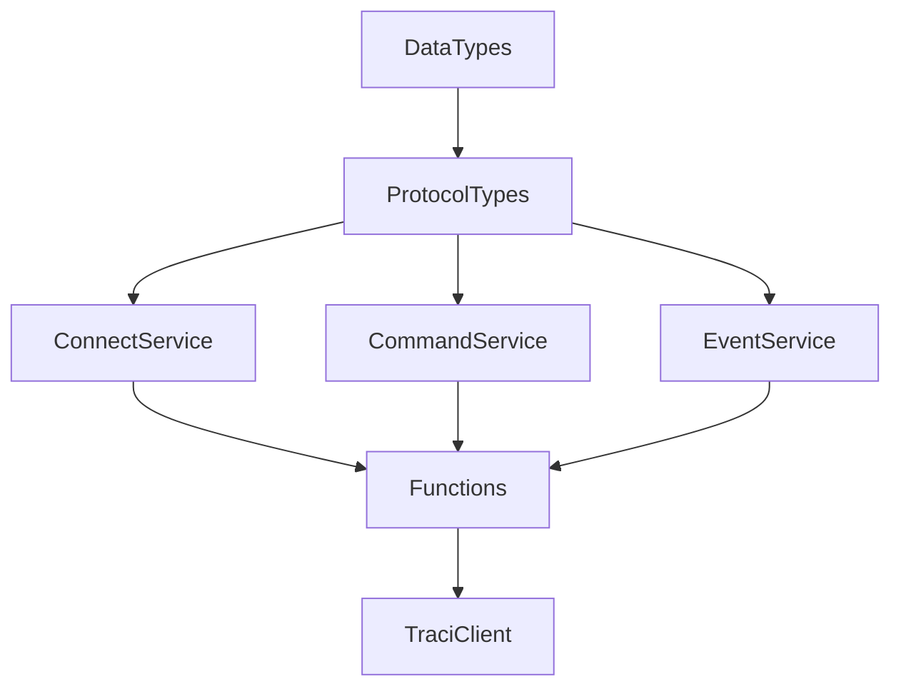

# CodingConnected.TraCI.NET
一个非官方的TraCI库的 .NET 实现。  
*该库由 [@Minokori](https://github.com/Minokori) 复刻自 [@CodingConnected](https://github.com/CodingConnected/)的库 [CodingConnected.TraCI](https://github.com/CodingConnected/CodingConnected.Traci) ,但仅仅包含了其中的 .NET 实现。如果您想阅读原始库的README文档，请点击 [此处](./README_old.md)。*  

*如果您在使用过程中发现了任何bug，请提交 issue。*  

[TOC]

## 介绍
由于原始库的较长时间未更新，且存在一些问题，因此复刻了该库，并增添了一些新的特性。  

+ 由 .NET framework 4.6.1 更新至 .NET 9.0
+ 由 Traci API 18 更新至 Traci API 21
+ 发布了一个 nuget 包
+ 修复了一些问题，<del>可能带来了一些新的问题</del>

### 如何使用
目前，该库基本上实现了 sumo 官方文档中定义的所有 TraCI 命令。调用方法的方式类似于 python 的 traci 库。  
*请注意，由于 SUMO 官方文档和相应的 Python 源代码中的 Traci接口也并不一致（一般来说，文档具有滞后性，即python中的方法比文档中描述的方法更加丰富），因此可能出现某个python traci接口在此库中并没有相应的实现。*

## 致开发者
如果您是一名开发者，或者您发现了某些 bug，期望在使用时修改源代码临时解决他们，那么您可以阅读以下内容，以便快速了解该库的组织结构。

### 依赖结构
该库主要由以下几个命名组成：
+ `DataTypes`: 定义 Traci 协议中定义的数据类型。
+ `ProtocolTypes`: 定义与 Traci 通过TCP交互时使用的类型。
+ `Service`: 该库使用了IoC模式，定义了库的服务接口和响应实现。包括：
    > 1. `ConnectService`: 与 Traci 进行 TCP 通信的服务
    > 2. `CommandService`: 执行 Traci 命令的服务，包括了发送命令和接受并解析响应的方法
    > 3. `EventService`: 在订阅了某些Traci对象的变量信息或上下文信息时，接收信息并触发相应事件的服务

在根命名空间，定义了一个 `TraciClient` 类，该类是整个库的入口点，用于连接到 SUMO 并执行 Traci 命令。  
以上结构的继承关系如下：

## TODO

- [ ] 测试。该库并未对所有的 Traci 命令进行测试，因此可能存在一些未知的问题。
- [ ] 优化代码结构。目前，该库的所有指令识别符定义在一个静态类中，这可能会导致代码的混乱。可以考虑将其分离到不同的内部类中。
- [ ] 完整的文档。目前，该库的文档并不完整，只有一些简单的注释。
- [ ] 更广的Traci API覆盖。在测试已实现的 Traci 命令能够正常工作后，可以考虑实现更多的 Traci 命令。