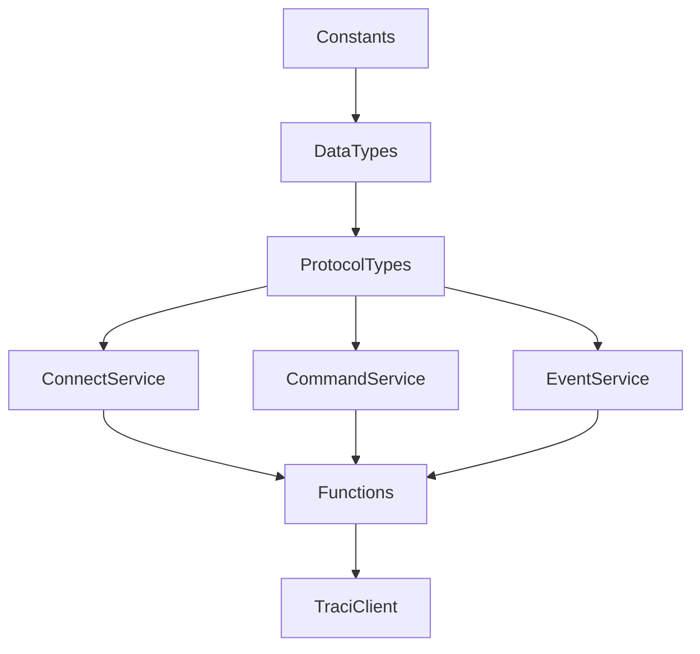

# CodingConnected.Traci

一个非官方的TraCI库的 .NET 实现。  
*该库由 [@Minokori](https://github.com/Minokori) 复刻自 [@CodingConnected](https://github.com/CodingConnected/)的库 [CodingConnected.TraCI](https://github.com/CodingConnected/CodingConnected.Traci) ,但仅仅包含了其中的 .NET 实现。如果您想阅读原始库的README文档，请点击 [此处](./CodingConnected.Traci/README_old.md)。*  

*如果您在使用过程中发现了任何bug，请提交 issue。*  

[TOC]

## 中文

### 概述

由于原始库的较长时间未更新，且存在一些问题，因此复刻了该库，并增添了一些新的特性。  

+ 由 .NET framework 4.6.1 更新至 .NET 9.0
+ 由 Traci API 18 更新至 Traci API 21
+ 发布了三个 nuget 包
+ 修复了一些问题，<del>可能带来了一些新的问题</del>

### 如何使用

目前，该库基本上实现了 sumo 官方文档中定义的所有 TraCI 命令。调用方法的方式类似于 python 的 traci 库。  

>  请注意，由于 SUMO 官方文档和相应的 Python 源代码中的 Traci接口也并不一致（一般来说，文档具有滞后性，即python中的方法比文档中描述的方法更加丰富），因此可能出现某个python traci接口在此库中并没有相应的实现。

### 致开发者

如果您是一名开发者，或者您发现了某些 bug，期望在使用时修改源代码临时解决他们，那么您可以阅读以下内容，以便快速了解该库的组织结构。

### 依赖结构

该库主要由以下几个命名空间组成：

+  `Constants`: 定义 Traci 命令中使用的字面值和枚举值

+ `DataTypes`: 定义 Traci 协议中定义的数据类型。
+ `ProtocolTypes`: 定义与 Traci 通过TCP交互时使用的类型。
+ `Service`: 该库使用了IoC模式，定义了库的服务接口和响应实现。包括：
    > 1. `ConnectService`: 与 Traci 进行 TCP 通信的服务
    > 2. `CommandService`: 执行 Traci 命令的服务，包括了发送命令和接受并解析响应的方法
    > 3. `EventService`: 在订阅了某些Traci对象的变量信息或上下文信息时，接收信息并触发相应事件的服务

在根命名空间，定义了一个 `TraciClient` 类，该类是整个库的入口点，用于连接到 SUMO 并执行 Traci 命令。 
以上结构的继承关系如下：

```mermaid
    graph TD
    	0[Constants] --> A

    	A[DataTypes] --> B[ProtocolTypes]
        B --> C1[ConnectService]
        B --> C2[CommandService]
        B --> C3[EventService]
      	C1 --> D[Functions]
      	C2 --> D
      	C3 --> D
      	D-->E[TraciClient]
```

## TODO

- [x] 测试。该库并未对所有的 Traci 命令进行测试，因此可能存在一些未知的问题。

   1.2.0 版本更新: 除 **订阅** 相关指令外, 所有指令都经过了测试. 

- [ ] 优化代码结构。目前，该库的所有指令识别符定义在一个静态类中，这可能会导致代码的混乱。可以考虑将其分离到不同的内部类中。

   1.2.0 版本更新: 修改了 Get/Set 使用的指令, 但变量有关的指令仍在根静态类中 <del>并非完全实现</del>

- [ ] 完整的文档。目前，该库的文档并不完整，只有一些简单的注释。

   1.2.0 版本更新: 增加了一些, 但仍不完整. <del>孩子们,写文档太麻烦了</del>

- [ ] 更广的Traci API覆盖。在测试已实现的 Traci 命令能够正常工作后，可以考虑实现更多的 Traci 命令。

   1.2.0 版本更新: 没有更广的 Traci API 覆盖. 您甚至会发现在python api 中存在的指令这里没有. 这是因为 SUMO官方的文档比python库要滞后.如果您发现了此类指令,欢迎提出 issue.

---

## English

### Overview

Since the original library has not been updated for a long time and there are some issues, the library has been forked and some new features have been added.  

+ Updated from .NET framework 4.6.1 to .NET 9.0
+ Updated from Traci API 18 to Traci API 21
+ Released three nuget packages
+ Fixed some issues <del> that may introduce some new ones</del>

### How to use

Currently, the library basically implements all the TraCI commands defined in the official sumo documentation. The way methods are called is similar to Python`s Traci library.  

> Please note that since the Traci interface in the official SUMO documentation and the corresponding Python source code are not consistent (in general, the documentation is lagged, i.e. the methods in python are richer than those described in the documentation), it is possible that a python traci interface is not implemented in this library.

### To the developers

If you`re a developer, or if you`ve found bugs and want to modify the source code to fix them temporarily while you`re using them, here`s a quick overview of how the library is organized.

### Dependency structure

The library consists of the following namespaces:

+ `Constants`: Defines the literal and enumerated values used in the Traci command

+ `DataTypes`: Defines the data types defined in the Traci protocol.

+ `ProtocolTypes`: Defines the types used when interacting with Traci over TCP.

+ `Service`: The library uses the IoC schema to define the service interface and response implementation of the library. Include:

> 1. `ConnectService`: A service that communicates with Traci over TCP
> 2. `CommandService`: The service that executes Traci commands, including methods for sending commands and accepting and parsing responses
> 3. `EventService`: A service that receives information and triggers an event when it subscribes to variable or context information for some Traci object

In the root namespace, a `TraciClient` class is defined, which is the entry point to the entire library to connect to SUMO and execute Traci commands. 
The inheritance relationship of the above structure is as follows:

```mermaid
    graph TD
    	0[Constants] --> A

    	A[DataTypes] --> B[ProtocolTypes]
        B --> C1[ConnectService]
        B --> C2[CommandService]
        B --> C3[EventService]
      	C1 --> D[Functions]
      	C2 --> D
      	C3 --> D
      	D-->E[TraciClient]
```

### TODO

- [x] Testing. The library is not tested for all Traci commands, so there may be some unknown issues.

   Version 1.2.0 Update: All commands have been tested **except for the subscription related commands**. 

- [ ] Optimize the code structure. Currently, all of the library's instruction identifiers are defined in a static class, which can lead to code confusion. You might consider separating it into different inner classes.

   Update 1.2.0: Changed the directives used by Get/Set, but the directives related to variables are still in the root static class and are not fully implemented

- [ ] Complete documentation. At the moment, the documentation for the library is incomplete, with only a few simple comments.

   Version 1.2.0 Update: Added some, but still incomplete. <del>Guys, it's too much trouble to write documentation</del>

- [ ] Broader Traci API coverage. After testing that the implemented Traci commands are working, consider implementing more Traci commands.

   Version 1.2.0 Update: No broader Traci API coverage. You'll even find instructions that exist in the Python API that aren't available here. This is because the official SUMO documentation lags behind the python library. If you find such a directive, you are welcome to open an issue.
